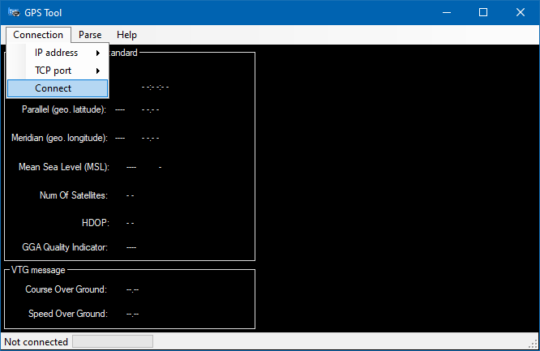
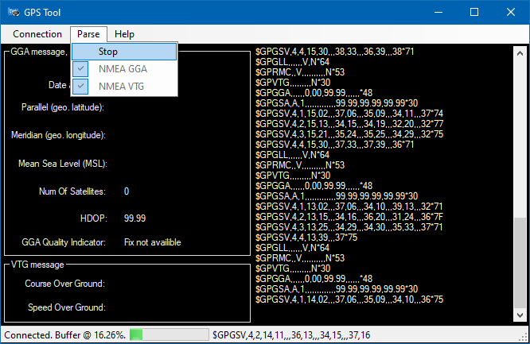
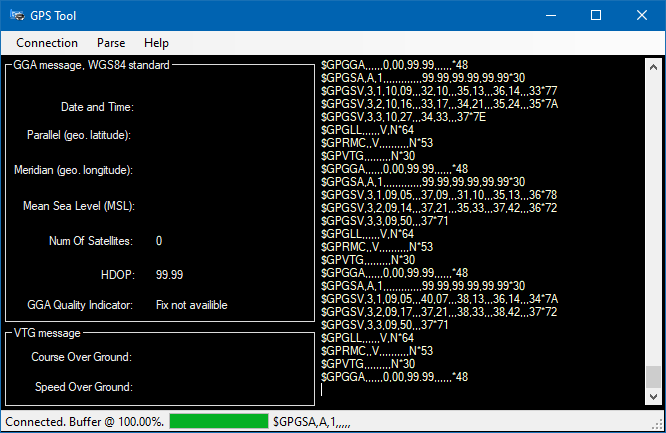

# Decode/parse GPS stream from a TCP server  
 Decode/parse GPS stream from a TCP server  
 
### Keywords  
> u-blox GY NEO6MV2 GPS module  
> Raspberry Pi as TCP Server  
> NMEA Parser  
> TCP, Client  
> Windows.Forms GUI (C# .NET) 
 
  

### App on start-up  
 

### GPS connected succesfully  
  
  

### No device found message  
  
 

### Table of Contents (Wiki)
[Wiki Home](https://github.com/etfovac/cs_tcp_gps/wiki)  
[Setup](https://github.com/etfovac/cs_tcp_gps/wiki/Setup)  
[Notes](https://github.com/etfovac/cs_tcp_gps/wiki/Notes)  
[References](https://github.com/etfovac/cs_tcp_gps/wiki/References)  
