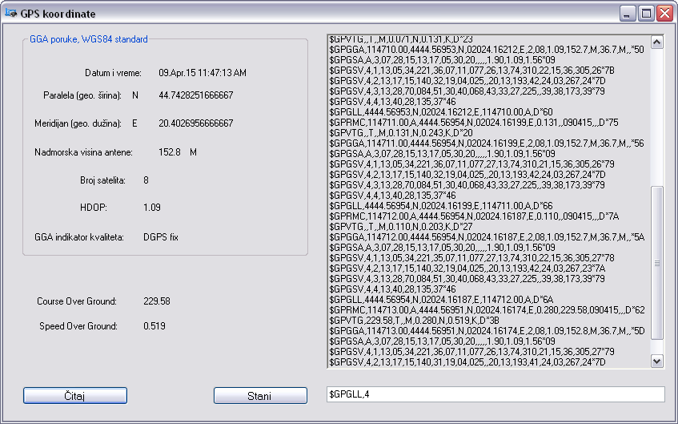
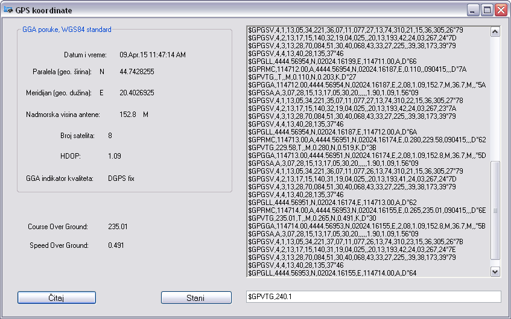
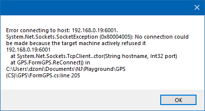
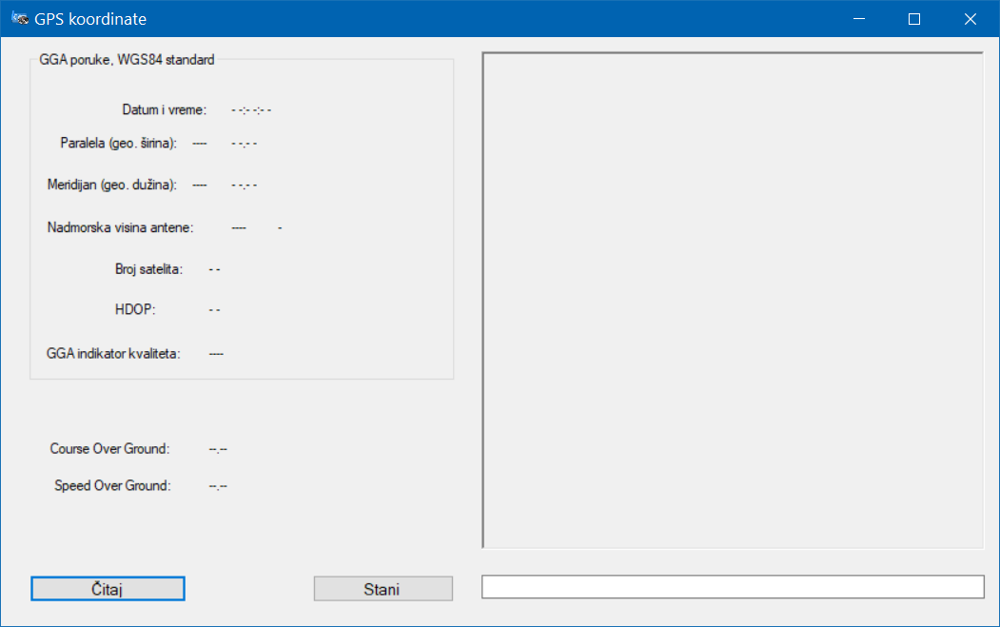

# Decode/parse GPS stream from a TCP server  
 Decode/parse GPS stream from a TCP server  
 
### Keywords  
> u-blox GPS module  
> NMEA Parser  
> TCP, Client  
> Windows.Forms GUI (C# .NET) 
 
  

### GPS connected succesfully 
  
  

### No device found 
  
  

### References  
<a href="https://www.u-blox.com/en/ubx-viewer/view/u-blox6-GPS-GLONASS-QZSS-V14_ReceiverDescrProtSpec_(GPS.G6-SW-12013)_Public?url=https%3A%2F%2Fwww.u-blox.com%2Fsites%2Fdefault%2Ffiles%2Fproducts%2Fdocuments%2Fu-blox6-GPS-GLONASS-QZSS-V14_ReceiverDescrProtSpec_%2528GPS.G6-SW-12013%2529_Public.pdf">u-blox.com - u-blox6-GPS Receiver Manual (PDF)</a>  
<a href="https://www.gpsworld.com/what-exactly-is-gps-nmea-data/">gpsworld.com - What Exactly Is GPS NMEA Data?</a>
